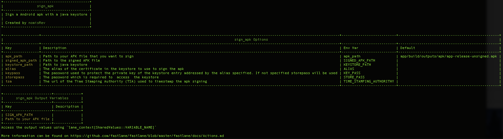
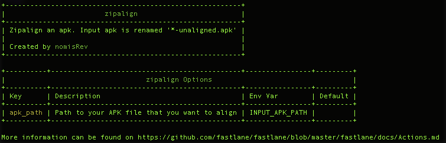

# Fastlane Android

While improving our continuous delivery system we decided to streamline the process for iOS and Android. Since our iOS team enjoyed using fastlane we decided to give it a try for Android as well.

If you take a look at the [fastlane](https://fastlane.tools) page you will notice that there are currently only 2 Android tools. `Supply` and `Screengrab`, both neat actions to automate uploading your app to Google play. But we wanted to do some more automating. Before you can upload an app to Google Play you need a signed and zip-aligned APK. As most Android developers know building an app ready for uploading to the store can be tedious. There are a few ways to do so.

1. Android Studio wizard: Build -> Generate Signed APK
2. Running a Gradle task with Gradle setup to sign and zipalign the APK
3. Command-line using `jarsigner` and `zipalign`

It's immediately obvious that the first option isn't suited for a CI environment. That leaves option 2 and 3.

If you know some scripting and Gradle, you can write some cool scripts that allow you to avoid checking in the key-store and passwords into version control. But this method requires you to do the Gradle setup for every project you do.

The goal was to streamline the process for iOS and Android so let's take a quick look at how they do it. By just taking a quick look at [fastlane](https://fastlane.tools) you'll see that most likely `gym` would be used for building, `snapshot` for taking screenshots and `deliver` for uploading to the App Store. The equivalent of `gym` was missing from the tools in fastlane to achieve our goal. In order to solve this I wrote 2 fastlane actions `sign_apk` and `zipalign`. With these two scripts we were able streamline the process.

If you want to do a `alpha` release to Google Play or iTunes Connect you want to be able to do this by simple triggering `fastlane alpha` so anyone that needs to be able to do this can do so with ease. For both iOS and Android this needs to build the app, sign it and upload it to the Alpha channel of its store.

So let's take a look at what goes on under the hood.

## Sign_apk

If you create a new Android Gradle project it comes with a few tasks preset for you. Without adding any new tasks you can build an APK by simply running `gradle assemble`. This will build apks for all the configs and build flavors you have.

If we take a quick look at the documentation fastlane provides for sign_apk `fastlane action sign_apk`, you can more or less figure out how it works.



* By default it will look for the default unsigned release APK to sign.
* The path to the key-store is required and the password to unlock it (Java keystore generated with `keytool` or a key-store generated with Android Studio)
* The alias of the key in the store it needs to use and the password to unlock it. (In case the key-pass is not provided it will try to use the store-pass)
* Time Stamping Authority is optional and is never used when building a signed APK with Gradle.
* It provides a new environment variable with the path to the signed APK.

For example triggering it from a lane might look like this:
```ruby
lane :sign_apk_lane do |options|
    sign_apk(
      alias: "android-fastlane-example",
      storepass: options[:storepass],
      keystore_path: "${HOME}/keyvault/android.jks",
      tsa: "http://timestamp.comodoca.com/rfc316",
      signed_apk_path: options[:signed_apk_path],
      keypass: options[:keypass]
    )
end
```

## Zipalign

This is a much more straightforward action as most of you will probably already be familiar with the `zipalign` command. (Beware the `zipalign` command was removed from the platform-tools folder and thus the PATH must be set correctly so the zipalign command can be found).



* The `zipalign` command takes an apk_path as input and renames the unaligned apk to `*-unaligned.apk`

## Alpha lane

Now that we have a signed and zip-aligned APK it's ready to be uploaded to Google Play with the fastlane action `supply`. More information on how to setup `supply` can be found [here](https://github.com/fastlane/fastlane/tree/master/supply#readme)

A Fastfile with an alpha lane for Android could look like this. It cleans the Gradle project, builds, signs and zipaligns the APK, runs tests and uploads it to Google Play Alpha channel.

```ruby
fastlane_version "1.97.2"

default_platform :android

platform :android do

  desc "Alpha release app. Deploy a new version to the Google Play Store - Alpha channel"
  lane :alpha do |options|
    gradle(task: "clean")

    gradle(task: "assemble")

    sign_apk(
      keystore_path: "${HOME}/keyvault/android.jks",
      alias: "android-fastlane-example",
      storepass: options[:storepass],
      tsa: "http://timestamp.comodoca.com/rfc316",
    )


    zipalign(apk_path: "#{lane_context[SharedValues::SIGNED_APK_PATH]}")
    gradle(task: "test")

  supply(
     track: 'alpha',
     apk: "#{lane_context[SharedValues::SIGNED_APK_PATH]}"
   )
  end
end
```

The only parameter that is required here is the password to unlock the store. This could be done with a more advanced setup using keychain, with a parameter `fastlane alpha storepass:'abc123!'` or simple by running `fastlane alpha` and waiting until fastlane asks for the password.

# Summary

Although fastlane is not yet equipped with the same tools for Android as it is for iOS, we enjoyed the experience and will continue to work with fastlane for both iOS and Android in the future. This solution suits our needs. There is always room for improvement. Feel free to recommend improvements or make a pull request!
